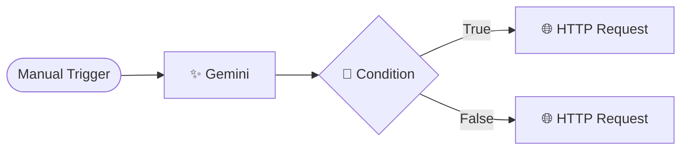
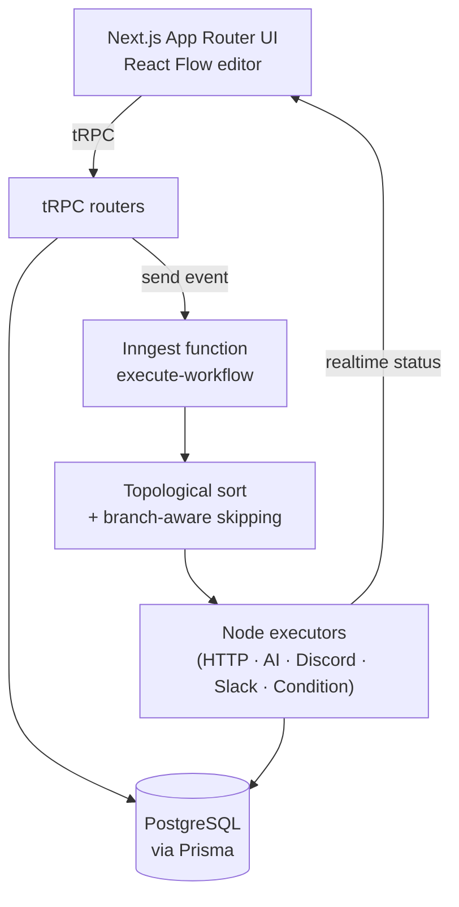

<div align="center">


# Nodeflo

**Build, automate, and run visual workflows — no code required.**

A self-hostable, n8n-style workflow automation platform. Drag nodes onto a canvas,
wire them together, and let AI, HTTP calls, and messaging apps do the work — with
branching logic, live execution status, and per-run history.


</div>

---

## 🎥 Demo

<div align="center">

[](https://www.youtube.com/watch?v=o4csOLXTzwk)

▶️ **[Watch the full demo on YouTube](https://www.youtube.com/watch?v=o4csOLXTzwk)**

</div>

<!-- Screenshot: drop editor.png into a docs/ folder and uncomment the line below -->
<!--  -->

---

## ✨ What it does

- 🎨 **Visual editor** — a React Flow canvas. Add nodes, drag to connect, double-click to configure.
- ⚡ **Durable execution** — workflows run on [Inngest](https://www.inngest.com/); each step is retried and recorded.
- 🟢 **Live status** — nodes light up **loading → success → error** in real time as a run progresses.
- 🔀 **Branching logic** — a **Condition** node routes flow down a **True** or **False** path.
- 🧩 **Variable passing** — reference any earlier node's output with `{{handlebars}}` templating.
- 🔐 **Encrypted credentials** — API keys are stored encrypted and never leave the server.
- 📜 **Execution history** — every run is saved with status, output, and error details.
- 👤 **Auth & billing** — email + GitHub/Google sign-in (better-auth), Pro plan via Polar.
- 🌗 **Light & dark mode** — theme toggle in the sidebar, persisted per user.

---

## 🧩 Node catalog

| Category | Nodes |
|---|---|
| **Triggers** | 🖱️ Manual · 📝 Google Form · 💳 Stripe event |
| **AI** | ✨ Gemini · 🤖 OpenAI · 🧠 Anthropic |
| **Actions** | 🌐 HTTP Request · 💬 Discord · 💬 Slack |
| **Logic** | 🔀 Condition (True / False branch) |

> Outputs are chained by variable name. e.g. an HTTP node saved as `myCall`
> exposes `{{myCall.httpResponse.data}}`; a Gemini node saved as `myAi` exposes `{{myAi.text}}`.

---

## 🚀 Build your first workflow

A real example: **ask Gemini a question, branch on the answer, then act.**



1. **Add a Gemini credential** — go to **Credentials → New**, pick *Gemini*, paste your Google AI Studio key.
2. **Gemini node** — Variable Name `indianStates`; User prompt: *"How many states are in India? Respond with only the number."* → output is `{{indianStates.text}}`.
3. **Condition node** — First value `{{indianStates.text}}`, operator **Greater than (>)**, second value `20`.
4. **HTTP nodes** — wire one off **True** and one off **False**; set an endpoint/method on each.
5. **Save** (top-right), then hit **Execute** (appears when a Manual Trigger is present) and watch the nodes light up.

---

## 🏗️ Architecture



**How a run works:** the UI sends a `workflow/execute.workflow` event → Inngest loads the
workflow, topologically sorts the nodes, and executes them in order. A shared `context`
object is threaded through every node (that's what `{{variables}}` read from). The
**Condition** node marks only its taken branch as "live", so downstream nodes on the
other branch are skipped. Each node publishes realtime status back to the canvas.

---

## 🛠️ Tech stack

| Layer | Choice |
|---|---|
| Framework | **Next.js 15** (App Router, Turbopack) · **React 19** |
| API | **tRPC 11** · **TanStack Query** |
| Database | **PostgreSQL** · **Prisma 6** |
| Execution | **Inngest** (durable steps + realtime) |
| Canvas | **React Flow** (`@xyflow/react`) |
| AI | **Vercel AI SDK** — Gemini, OpenAI, Anthropic |
| Auth | **better-auth** (email · GitHub · Google) |
| Billing | **Polar** |
| Templating | **Handlebars** (variable interpolation) |
| Styling | **Tailwind CSS v4** · **shadcn/ui** |

---

## 🏁 Getting started

### Prerequisites
- Node.js 20+
- A PostgreSQL database (local, or [Neon](https://neon.tech) / Supabase / Vercel Postgres)

### 1. Install
```bash
git clone <your-repo-url>
cd workfloauto
yarn install
```

### 2. Configure environment
```bash
cp .env.example .env
```
Fill in `.env` — the required keys are documented inline in [`.env.example`](.env.example).
At minimum you need `DATABASE_URL`, `BETTER_AUTH_SECRET`, and `ENCRYPTION_KEY`.

### 3. Set up the database
```bash
npx prisma migrate dev   # apply migrations + generate the client
```

### 4. Run it
```bash
yarn dev:all   # Next.js + Inngest dev server together (via mprocs)
# — or run them separately —
yarn dev       # Next.js only
yarn inngest   # Inngest dev server (needed for workflows to execute)
```

Open **http://localhost:3000**.

---

## ☁️ Deployment

The build script applies pending migrations and regenerates the Prisma client on every deploy:

```jsonc
"build": "prisma generate && prisma migrate deploy && next build --turbopack"
```

> **Important:** `DATABASE_URL` must be available at **build time** (not just runtime),
> because `prisma migrate deploy` runs during the build. On Vercel, add it to the
> Production environment variables. Set the Inngest and OAuth/Polar keys there too
> (see `.env.example`).

---

## 📁 Project structure

```
src/
├── app/                      # Next.js routes (dashboard, editor, auth, api)
├── components/               # Shared UI + React Flow primitives
├── config/                   # Node registry (node-components.ts)
├── features/
│   ├── editor/               # Canvas, header, save/execute
│   ├── triggers/             # Manual · Google Form · Stripe
│   ├── executions/           # Action & logic nodes + run history
│   │   └── components/
│   │       ├── http-request/ · gemini/ · openai/ · anthropic/
│   │       ├── discord/ · slack/
│   │       └── condition/    # 🔀 branch node (UI + evaluator)
│   ├── credentials/          # Encrypted API-key management
│   ├── workflows/            # Workflow CRUD (tRPC)
│   └── subscriptions/        # Polar billing
└── inngest/                  # Execution engine, channels, functions
```

Each node is self-contained: `node.tsx` (canvas UI), `dialog.tsx` (settings form),
`executor.ts` (server-side run logic), `actions.ts` (realtime token), and a matching
channel in `src/inngest/channels/`.

---

<div align="center">

**Built by [addydist](https://github.com/addydist)**

<sub>Made with Next.js, Inngest, and React Flow.</sub>

</div>
